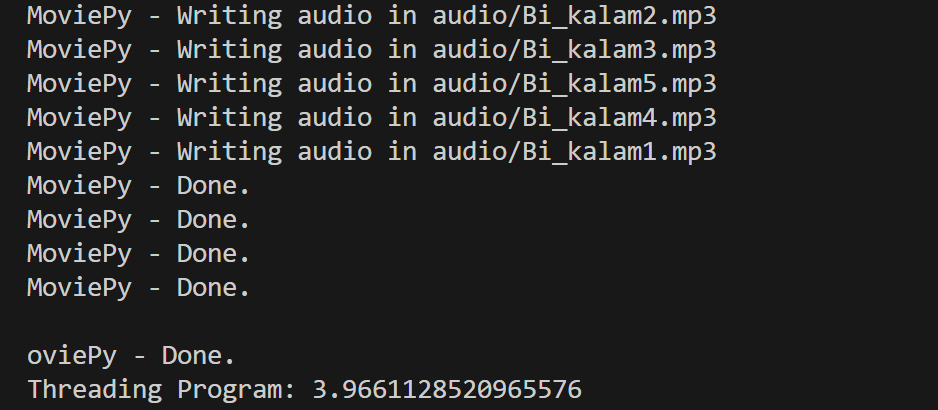

# Assigment 24

# 1-Interstellar Game with Threading


Game that its name is interstellar. there is a spaceship at the bottom of the game window belong to you.
Another spaceships is going to come from the top of the game window. these spaceships are our enemies.

| Game instructions |                                    |
|-------------------|------------------------------------|
| move to right     | select arrow key right or select D |
| move to left      | select arrow key left or select A  |  
| fire              | select space                       |


## How to fight with enemies?

futhermore we can fire with enemies with spacekey. when you press space on keyboard, a bullet will shoot.
fortunately we have three lives in this game and we can continue playing game even we let enemies pass us and enter our planet for two times.


### Remember this point:

Anytime you collision with one of the enemies, you will lose and game over.

### Using Thread

+ In this version of code ,i have used Thread module for creating enemies , so each of the enemy will be built after 3 sec.
In this program, threading is used to create enemies
An attractive game for entertainment and leisure.


## Game over modes:
1. Run out of player hearts.
2. The player's spaceship crashes with the enemy's spaceship.


>## How to Run
execute this command in terminal:
Run following command :
```
python game.py
```


#  2-Movie To Sound** 🔊
## Using Thread 


> + in this program , we want to convert videos into audios , in 2 ways :
> 1. normal converting with 'Normal_execution' method
> 2. convert files using 'Thread'

## Requirements :
first you have to install moviepy :
> + pip install movipy
then import it in the code .


## Result 
## Normal converting
> execution time for 5 vodeo files ,with Normal converting was : 

## Multi-Treading
> + and execution time using Multi-Treading was :

> + as shown in the below image :


>## How to Run
execute this command in terminal:
Run following command :
```
python movie_to_sound.py
```


